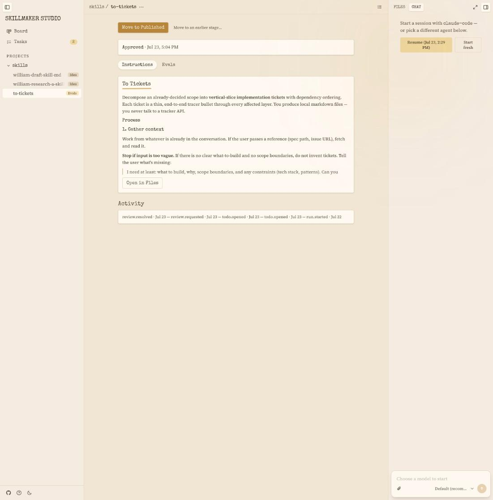
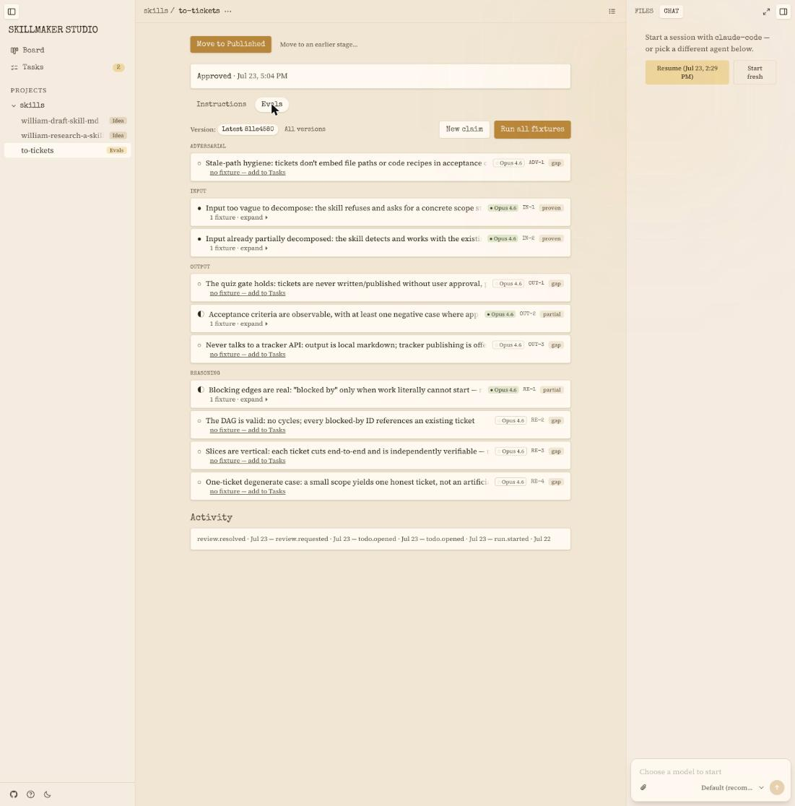
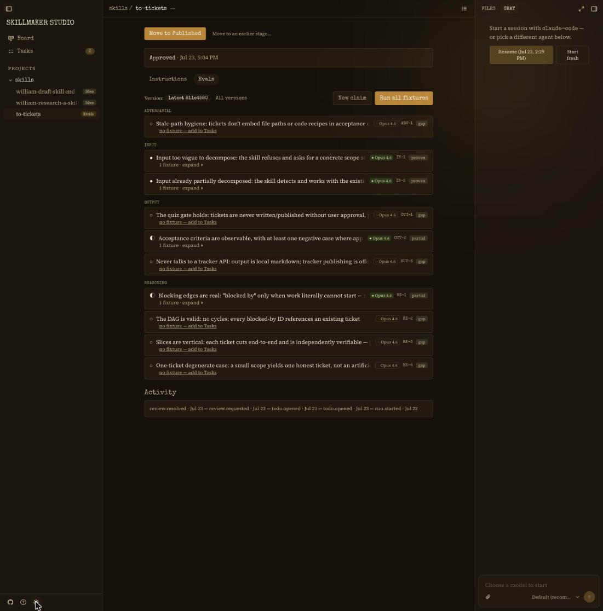

# Skillmaker Studio

**Build, evaluate, and maintain agent skills.**

One app, many projects. A project is a directory that contains skills; the
skill is the primary object — everything else in the Studio is a view of
skills or an action on one. Skills, their eval fixtures, and their run
records live as files in your project, git-tracked and cloneable with
their evidence.

[](https://github.com/sociotechnica-org/skillmaker-studio/actions/workflows/ci.yml)

## Getting started

```sh
npx skillmaker-studio start
```

Then add your first project from the sidebar's **+** — point it at any
directory that holds (or should hold) skills, or create a new one. The
Studio runs once per machine and remembers your projects in
`~/.skillmaker-studio/config.json`; `start` works from anywhere.

Or install once and use the `skillmaker` bin day to day:

```sh
npm i -g skillmaker-studio
skillmaker project add .   # register a project from the terminal instead
skillmaker start
```

npm resolves a compiled platform binary (macOS arm64 + x64, Linux x64,
and Windows x64) — no postinstall scripts, no runtime downloads. There is also a
[`/skillmaker` skill](packages/skill/skillmaker/SKILL.md) for driving the
same CLI from inside Claude Code or Codex.

## The Studio

The left sidebar is the spine: your projects and their skills, plus two
global views — a **Board** of every skill by stage and a **Tasks** queue of
work to do across all of them. The center is the **Skill page**: the live
SKILL.md rendered, reviews and stage moves, evals, and activity. The right
panel holds a **Files** browser over the skill's bundle and a **Chat**
panel for agent sessions. Everything updates live as work lands, in light
and dark.



### Chat-first creation

Describe the skill you want; an agent frames it, researches, and drafts it
in conversation. Each skill gets its own agent session — claude-code or
codex, with a model picker, effort control, and image attachments —
working directly in your project. The session is transport; everything the
agent decides lands on disk in the skill's files.

### Claim-first evals

Evals start from **claims**: the things the skill is supposed to get right,
grouped by risk family (Input / Reasoning / Output / Adversarial / Chain).
Fixtures hang under the claims they probe; runs hang under fixtures. Every
claim row shows per-model evidence chips at a pinned version — proven,
partial, or gap — and "no fixture yet" is an honest state with a one-click
path into the Tasks queue, not a hidden one. Runs record whether the skill
was actually invoked and carry their grades separately: coverage and
validation never blur. Fixtures are runnable straight from the UI ("Run
all fixtures"), or from the CLI.





### Agent-first

Everything the UI does rides the same engine as the `skillmaker` CLI.
Agents are first-class users: an agent working in your repo and a human
working in the Studio see and change the same state.

## Caveats

Early software. The chat panel and eval runs drive a real coding agent, so
they require Claude Code or Codex installed and authenticated on your
machine. The Windows build is new in 0.6.0 and lightly traveled — please
[open an issue](https://github.com/sociotechnica-org/skillmaker-studio/issues)
if anything misbehaves there.

## Repo layout

```
packages/core/            # @skillmaker/core — domain: schemas, journal, fold, machine, index
packages/cli/             # @skillmaker/cli — the skillmaker CLI + server (bin: skillmaker)
packages/viewer/          # @skillmaker/viewer — Astro 5 + React 19 + Tailwind 4 UI
packages/skill/           # the /skillmaker skill for Claude Code / Codex
packages/desktop/         # @skillmaker/desktop — Tauri v2 shell wrapping the CLI (macOS)
packages/docs-site/       # @skillmaker/docs-site — Starlight docs (docs.skillmaker.studio)
packages/marketing-site/  # @skillmaker/marketing-site — public site
npm/                      # the skillmaker-studio npm wrapper + platform binary packages
docs/                     # product plans and design docs (see docs/README.md)
test/e2e/                 # end-to-end tests that spawn the real CLI
```

Bun-workspaces monorepo; package-local guidance in each package's README.

## Development

```sh
bun install               # also clones the Effect research repo (skip: SKIP_EFFECT_CLONE=1)
bun test packages         # unit tests
bun run build:viewer      # build the viewer (required before start / e2e)
bun run test:e2e          # e2e against the real CLI
bun packages/cli/src/main.ts --help
```

CI runs typecheck, unit, viewer build, and e2e on every PR.

## License

[MIT](LICENSE) © SocioTechnica
